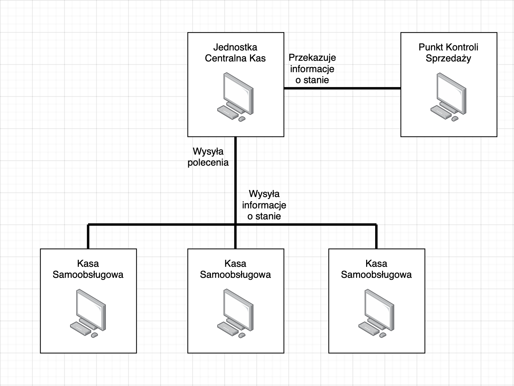

# System Kas Samoobsługowych w Supermarkecie

Autorzy: 
* Paweł Cirko, 
* Bartosz Tatys, 
* Krzysztof Wiśniewski

## Słownik pojęć
* SKSO - System Kas Samoobsługowych
* KSO - Kasa Samoobsługowa
* JCK - Jednostka Centralna Kas
* PKS - Punkt Kontroli Sprzedaży
* UKS - Umowa Kupna-Sprzedaży

## Lista 1 - wstęp
### Co?
Celem systemu jest usprawnienie procesu zawierania umów kupna-sprzedaży pomiędzy sklepem a klientem detalicznym. 

Przez "usprawnienie" rozumiemy: 
1. Przyspieszenie procesu zakupów dla klientów,
2. zwiększenie wydajności sklepu dzięki zmniejszeniu kolejek,
3. oszczędność czasu personelu,
4. oszczędność przestrzeni na sali sprzedaży,
5. dostosowanie do preferencji klientów,
6. zwiększenie poziomu bezpieczeństwa,
7. automatyzacja zbierania danych sprzedażowych.

### Jak?
SKSO umożliwiają wykonanie powyższego, dzięki zastosowaniu szeregu rozwiązań hardwarowych oraz softwarowych. Wstępna wersja systemu wygląda następująco: 

* **Kasa samoobsługowa** - Głównym jej zadaniem jest sprzedaż towarów z wykorzystaniem sensorów (skaner, waga). Użytkownik komunikuje się z kasą za pomocą ekranu dotykowego. Aby ograniczyć koszty oraz zwiększyć możliwości rozbudowy, KSO posiada ograniczoną moc obliczeniową oraz niewielką pamięć wewnętrzną. Kasa komunikuje się z peryferiami takimi jak kasy fiskalne czy terminale płatności kartą, które same w sobie nie są częścią systemu. KSO wysyła informacje o swoim aktualnym stanie (zeskanowanie towaru, status płatności) do JCK. Kasa przyjmuje polecenia od JCK.

* **Jednostka centralna kas** - mózg całego systemu. Z tego punktu możliwy jest podgląd utargu, czy zarządzanie funkcjonowaniem poszczególnych KSO. JCK pobiera dane ze wszystkich KSO, nastepnie je przekształca do formy przydatnej dla pracowników sklepu. JCK przekazuje niektóre z tych danych do PKS. W przypadku sieci z wieloma lokalizacjami możliwe jest także wysyłanie danych w czasie rzeczywistym do "centrali".

* **Punkt kontroli sprzedaży** - Umożliwia integrację z systemem kamer bezpieczeństwa wyświetlając informacje odnośnie aktualnie skanowanych towarów oraz statusu płatności. Dane pobiera z JCK.

### Gdzie?

KSO musi zostać umieszczone w specjalnie do tego przygotowanej strefie, zazwyczaj znajdującej się obok tradycyjnych kas sprzedażowych. Punkt taki musi posiadać stały dostęp do prądu. Co więcej, KSO musi zostać wyposażone w dostępny na stanie sklepu terminal do przyjmowania płatności kartą oraz kasę fiskalną. Zalecane jest także umieszczenie kamery monitoringu bezpośrednio nad strefą kasowania towarów. 

JCK umieszczone jest na zapleczu sklepu, w miejscu dogodnym dla managera. 

PKS umieszczone jest w miejscu pracy pracownika ochrony sklepu.

Każde KSO musi zostać połączone z fizycznym kablem do JCK.
JCK i PKS posiadają dostep do Internetu.

### Kto?
SKSO przewiduje następujące osoby korzystające z systemu:
1. **Klient sklepu** - umożliwia się mu dokonywanie zakupów poprzez skanowanie towarów oraz obsługę płatności.
2. **Pracownik sklepu** - umożliwia się mu to, co klientowi sklepu. Dodatkowo pracownik może wycofać ówcześnie zeskanowane towary, potwierdzić wiek osoby kupującej, włączać/wyłączać SCO.
3. **Manager sklepu** - umożliwia się mu to, co pracownikowi sklepu. Dodatkowo manager może zdalnie zmieniać ceny produktów oraz kontrolować utarg KSO. Stacjonarnie może podpinać podzespoły takie jak terminale czy kasy fiskalne. 
4. **Pracownik ochrony sklepu** - umożliwia się mu zdalne kontrolowanie zeskanowanych towarów w czasie rzeczywistym.
5. **Serwisant** - umożliwia się mu wszystko to, co pozostałym kategoriom. Dodatkowo serwisant może uzyskać dostep do logów generowanych przez system.

### Dostosowanie do wymogów
Ustawodawca przewidział szereg ograniczeń do UKS, które system wykorzystywany komercyjnie musi spełniać:
1. Przepisy dotyczące **uczciwego handlu**: Warunek ten zostane spełniony przez zastosowanie atestowanych czujników.
2. Regulacje dotyczące **ochrony danych osobowych** RODO. Warunek ten zostanie spełniony przez niezbieranie danych umożliwiających identyfikację kupującego.
3. Regulacje dotyczące **zapewnienia dostępności**. Warunek ten zostanie spełniony poprzez dodanie przycisku umożliwiającego wezwanie pomocy pracownika sklepu na dowolnym etapie interakcji z systemem.
4. Przepisy dotyczące **praw konsumenta**. Warunek ten zostanie spełniony przez dodanie do systemu kasy fiskalnej drukującej paragony oraz faktur uproszczonych (paragon z NIP). Wszelkie zwroty będą rozliczane w kasach obsługiwanych przez pracowników sklepu.
5. Przepisy dotyczące **ochrony zdrowia nieletnich**. Warunek ten zostanie spełniony dzięki uniemożliwieniu sprzedaży konkretnych towarów bez zatwierdzenia wieku klienta przez pracownika sklepu.

<!---
## Lista 2 - przypadki użycia 
### Lista przypadków użycia
### Diagram przypadków użycia

## Lista 3 - hardware
### Diagram komponentów systemu
### Diagram stanów systemu

## Lista 4 - 
### Opis działania systemu
### Integracja dokumentacji
-->
